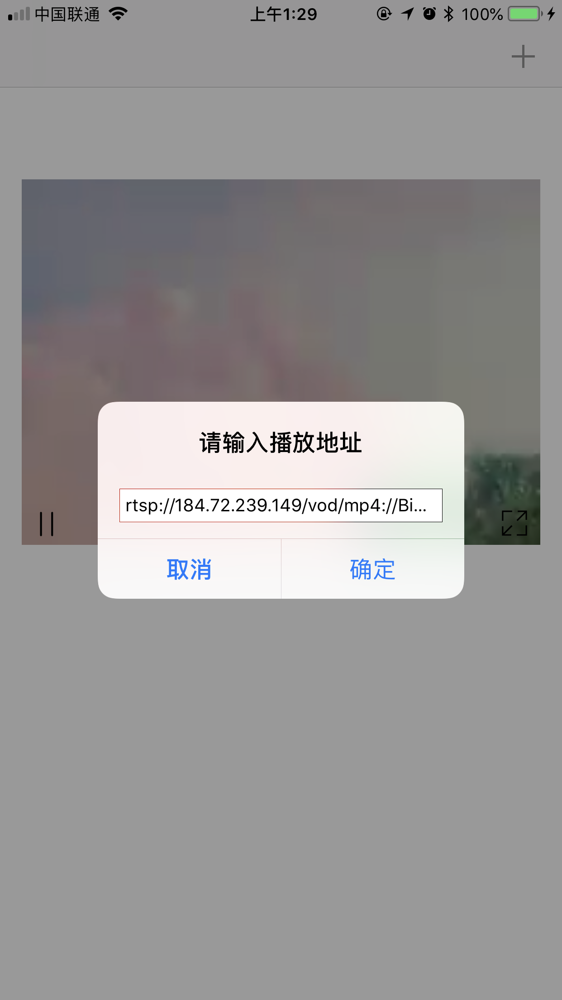
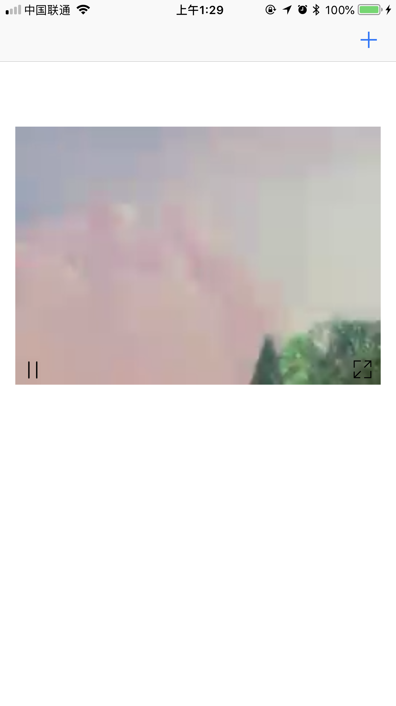
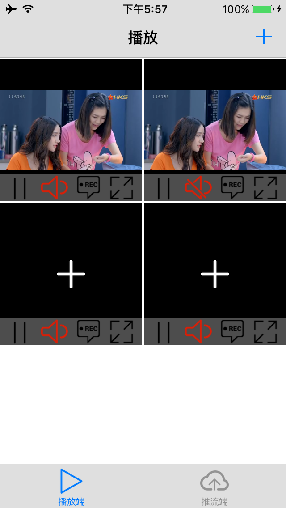

# Car-Eye 开源平台 iOS播放客户端

目前支持：
* 音视频播放

* 断开重连
## • 运行说明：

  下载demo，运行 双击CarEyePlayer.xcworkspace 文件，内含carEyeRTSPPlayer.xcodeproj 工程文件和CarEyeRTMP.xcodeproj 工程文件，前者为 RTSP 播放客户端，后者为RTMP 协议播放客户端（即将支持RTMP推流）,只支持真机运行，故运行demo时请使用真机，不要使用模拟器。否则编译失败。

  ## 一、RTSP 视频流播放

  #### • car-eye RTSP 播放器目前支持H.264**，**H.265**，**MPEG4**，**MJPEG 视频软硬解码，音频方面支持AAC、G711A,G711U,G726等。

  

  运行截图：

  

  下载地址：<https://testflight.top/t/IRZ3um> 

  appstore地址：

#### • 接口说明

##### 一、激活播放器 

CarEye_RtspActivate(key)

##### 二、创建句柄

CarEye_RtspCreate(*handle) 创建句柄 

##### 三、关联句柄和回调函数

CarEye_RtspEventRegister(CarEye_RTSP_Handle handle, RTSPSourceCallBack callback); 

 handle 由上一步获取，callback说明查看代码

typedef int (CE_APICALL *RTSPSourceCallBack)( int channelId, void *userPtr, CarEye_FrameFlag frameType, char *pBuf, CarEye_RtspFrameInfo* frameInfo);  的注释

rtsp 视频流将在下一步拉流开启后通过这个回调函数传过来。客户端主要关注 frameInfo 参数，即为获取到的音视频帧数据。

##### 四、开始拉流

CarEye_RtspStart(CarEye_RTSP_Handle handle, int channelId, char *url, 

​										CarEyeRtpConnectType connType, CarEye_FrameFlag mediaType, 

​										char *userName, char *password, void *userPtr, 

​										int reCount, int outRtpPacket, int heartbeatType, int verbosity);

传入上文注册好的并且关联好回调函数的句柄， 开始获取视频流数据。

##### 五、释放资源

关闭拉流 CarEye_RtspStop(CarEye_RTSP_Handle handle); 

释放句柄 CarEye_RtspRelease(CarEye_RTSP_Handle *handle);  

## 二、RTMP 客户端
  RTMP 客户端分为两个主要功能部分，播放端和推流端。
  播放端基于ijkplayer，支持软解码和硬解码，支持大部分的音视频编码格式，支持多路视频同时播放。在ijkplayer基础上扩展了录制和截图功能，源码放在了这里：https://github.com/sumbrilliance/ijkplayer.git
  ## • 运行说明：
  	clone 项目后，内含CarEyeRTMP.xcodeproj工程，即为RTMP客户端。内含IJKMediaPlayer.xcodeproj，工程，由于此工程包含文件过大，因此未加入到CarEye的源码中，里面的IJKMediaPlayer工程将是空的。所以，需要先clone获得IJKMediaPlayer。
  	clone和编译ijkplayer的过程比较漫长，你也可以直接下载careye编译好的IJKMediaFramework.framework文件(在car-eye-player-IOS第一层目录下，release版本)，导入其中，删除IJKMediaPlayer.xcodeproj的引用。
  	以下为使用 IJKMediaPlayer.xcodeproj 的过程：
  1. clone Car-eye-player 后，进入 car-eye-player/CarEyeRTMP/CarEyeRTMP/ 目录，根据 https://github.com/sumbrilliance/ijkplayer.git 中的编译说明，按以下顺序执行：
    clone https://github.com/Car-eye-team/Car-eye-player-IOS.git
    cd car-eye-player-IOS/CarEyeRTMP/CarEyeRTMP/
    git clone https://github.com/Bilibili/ijkplayer.git  ijkplayer-ios
    cd ijkplayer-ios
    ./init-ios.sh
    cd ios
    ./compile-ffmpeg.sh clean
    ../compile-ffmpeg.sh all

  此步完成后，打开 CarEyePlayer.xcworkspace 文件即可
  运行截图：
  
  

# Car-eye-player 播放器系列

Car-eye-player-rtsp android你扫描二维码下载

car-eye-player-windows: https://github.com/Car-eye-team/car-eye-player-windows

# 联系我们

car-eye 开源官方网址：www.car-eye.cn    

car-eye 流媒体平台网址：www.liveoss.com  

car-eye 技术官方邮箱: support@car-eye.cn

car-eye技术交流QQ群: 590411159        

  

CopyRight©  car-eye 开源团队 2018

